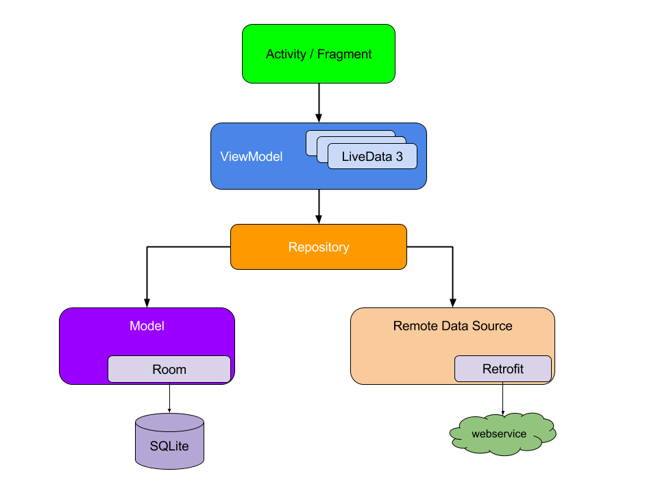
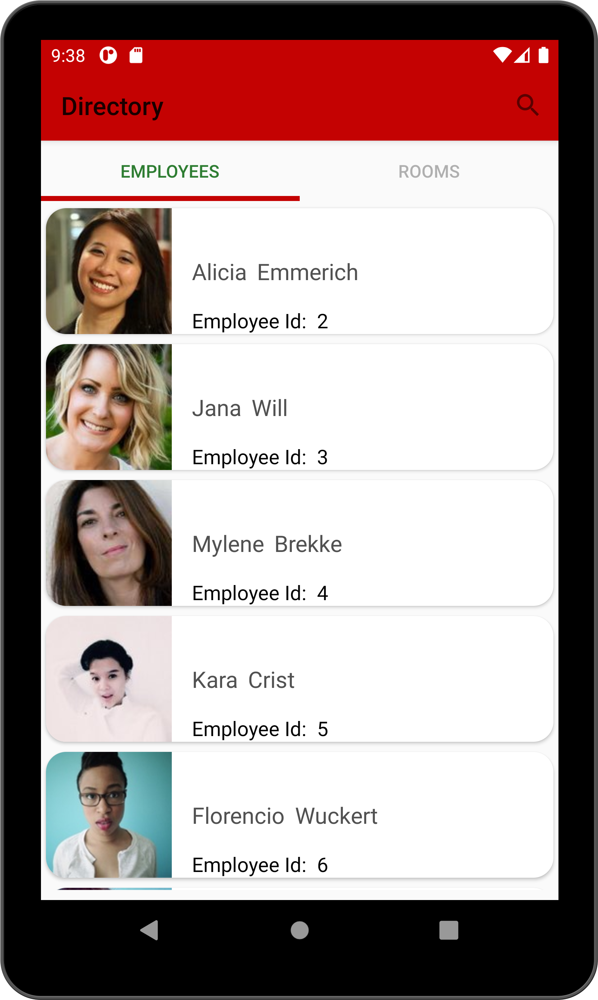
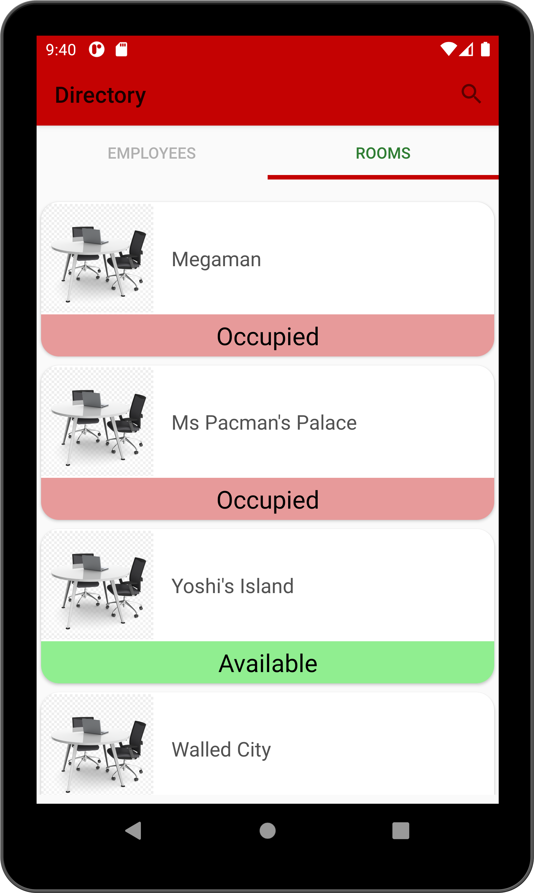
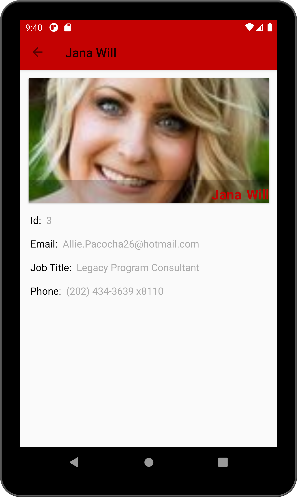
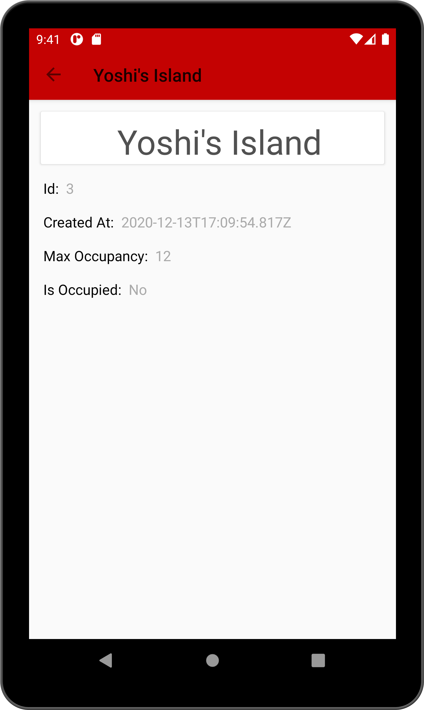

# directory
Android app shows the list of office employees and rooms

1. Koltin as language

2. Retrofit for networking

3. Coroutine for computation and network scheduling

4. Hilt for dependency injection

5. Unit Test: JUnit

6. Architecture Components: MVVM, room, liveData

7. Navigation Controller

Screens

